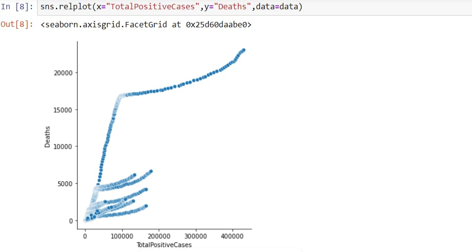
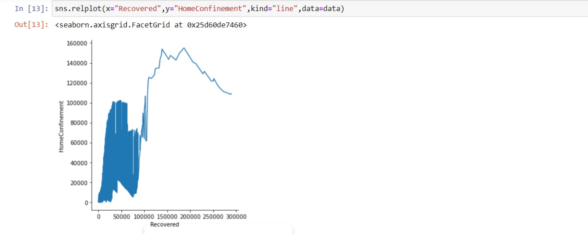
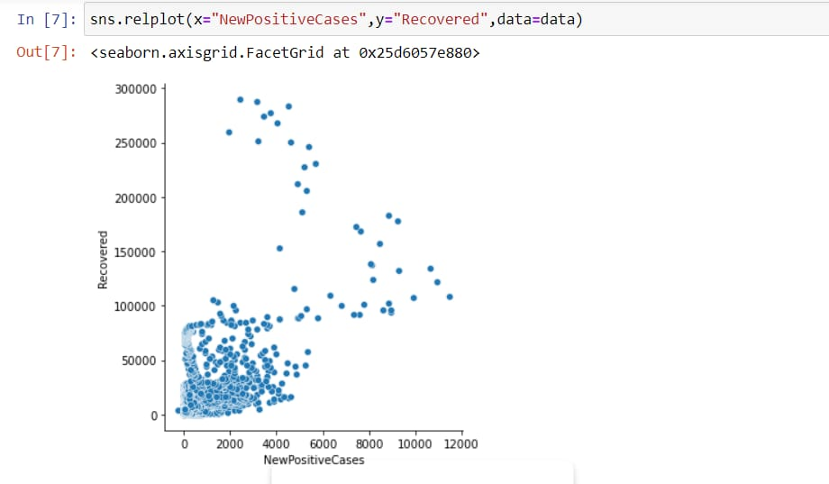
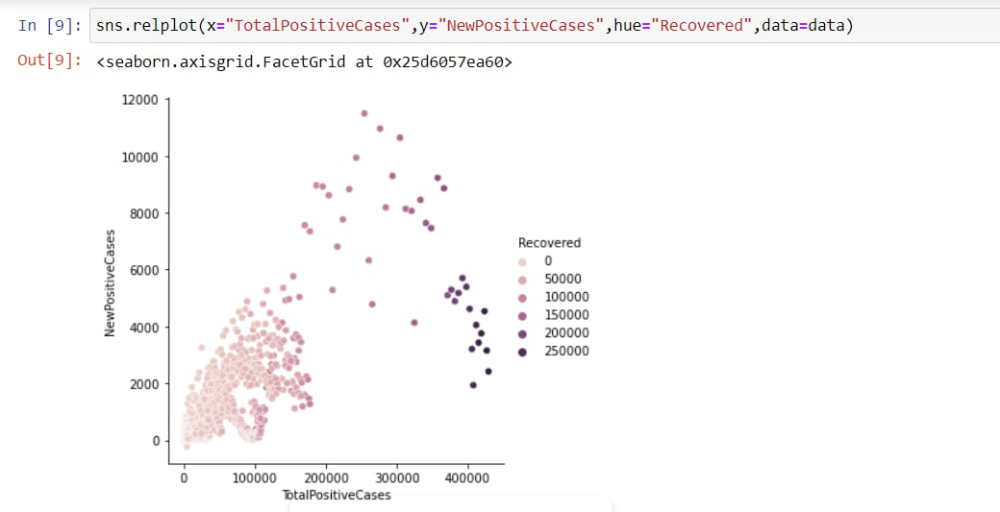
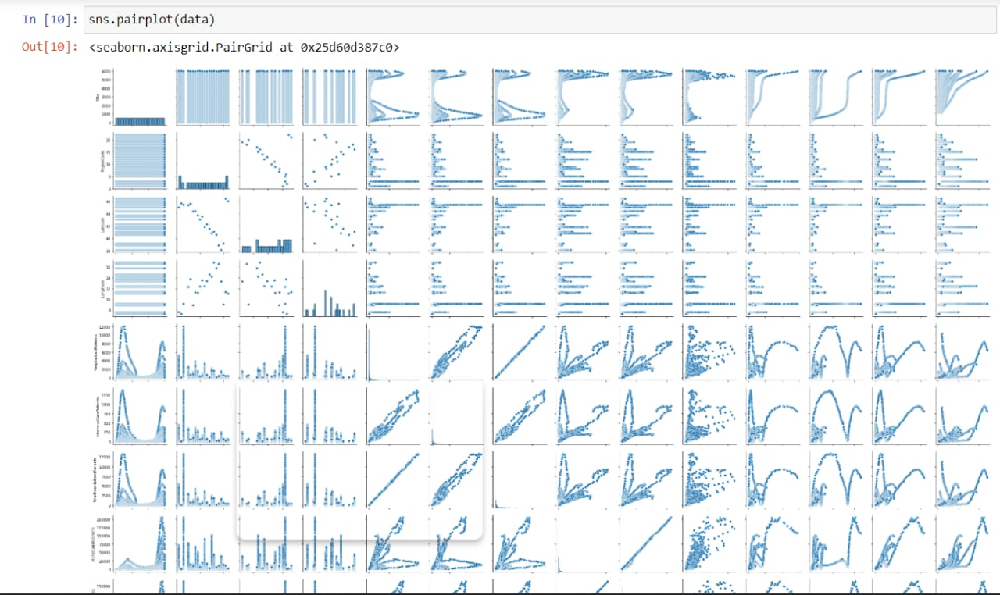

# Explorative Data Analysis of COVID-19 Data in Italy

This project report presents on data analysis and visualization of COVID-19 data of Italy.
   
Italy was, unfortunately, one of the most impacted countries during pandemic, so in this project I try to obtain some insights by visualizing the available data. 

# Data
I have used the data that is found in https://www.kaggle.com/datasets /sudalairajkumar/covid19-in-italy . Further information on the data can be found by following the link.

# Visualization

Let's see in detail:

1. Visualising Total Positive Cases vs Deaths

2. Visualising a line graph of HospitalizedPatients vs home confinement

3. Visualising NewPositive Cases vs Recovered

4. Visualising Total PositiveCases vs NewPositive Cases and introducing HUE through Recovered data

5. Creating a pairplot of complete data

